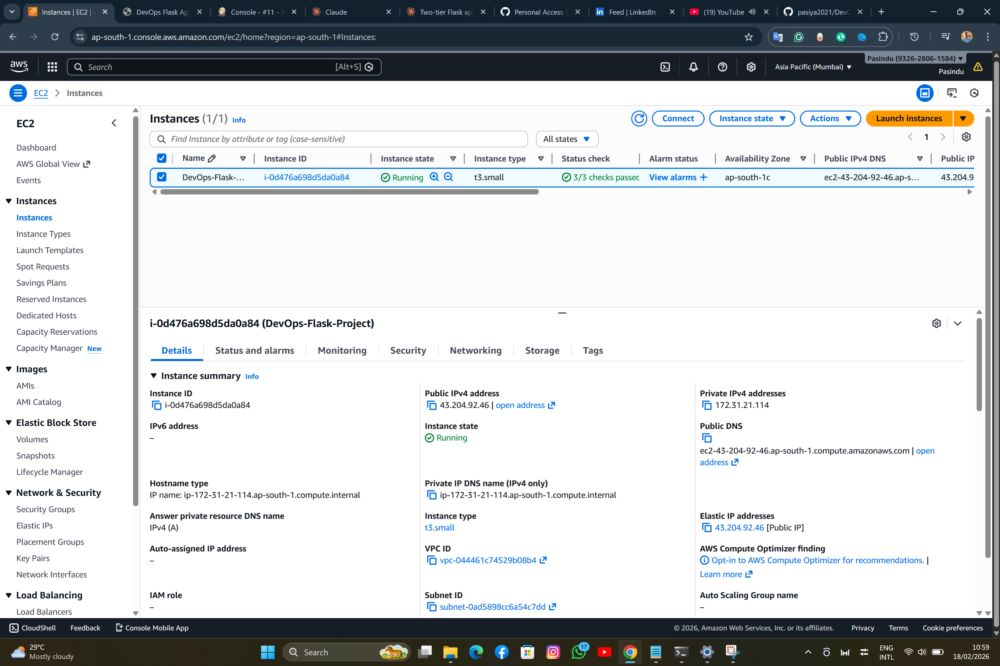
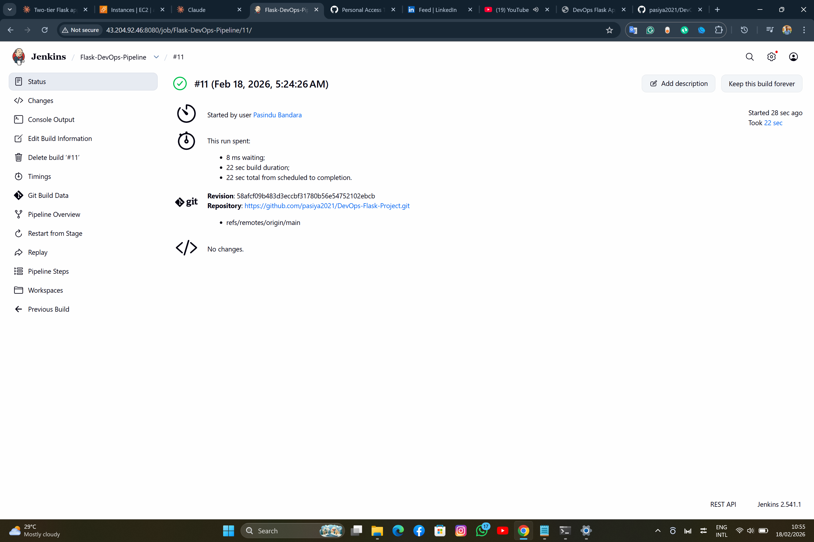
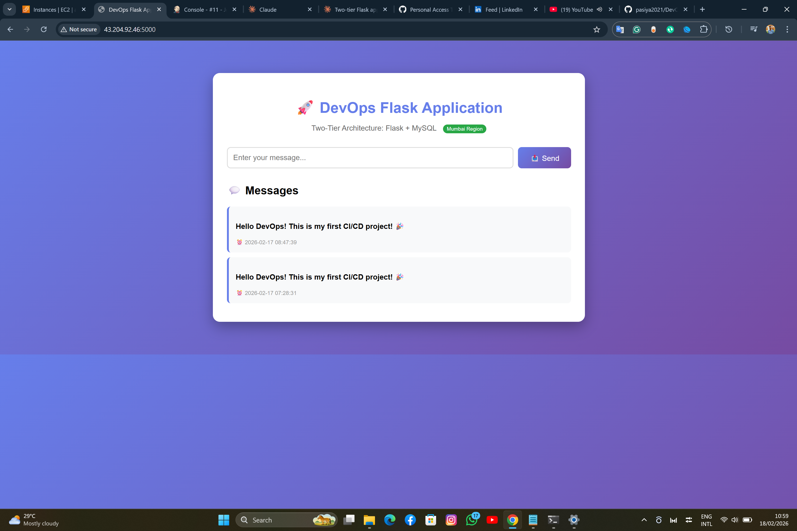
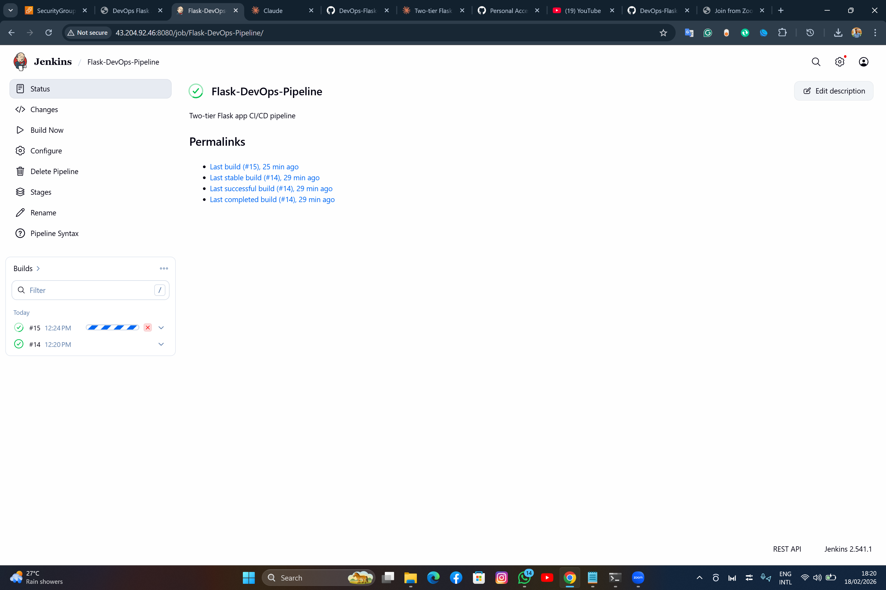
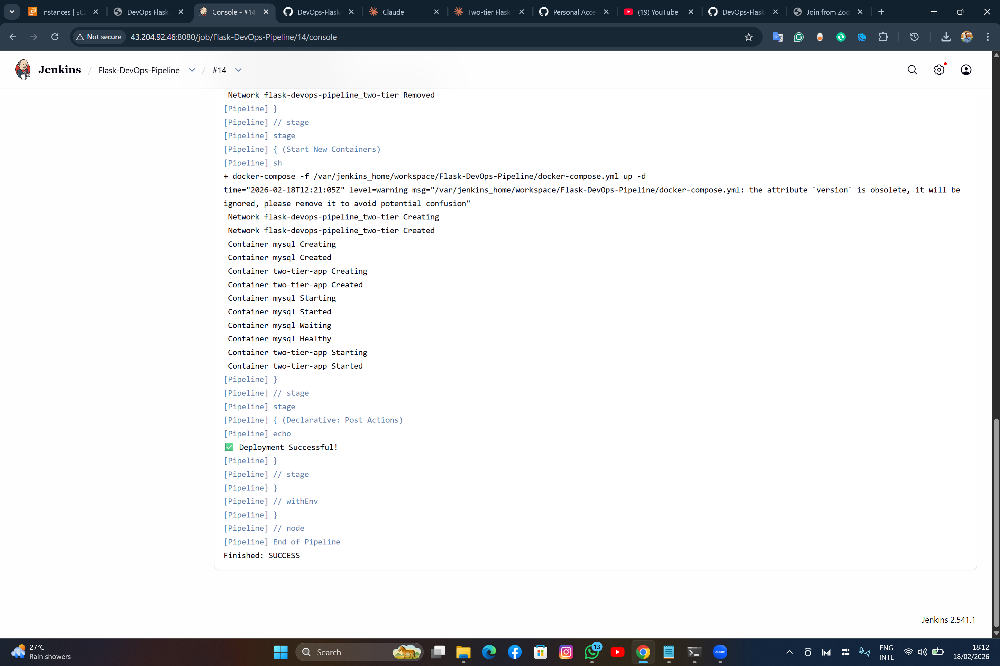
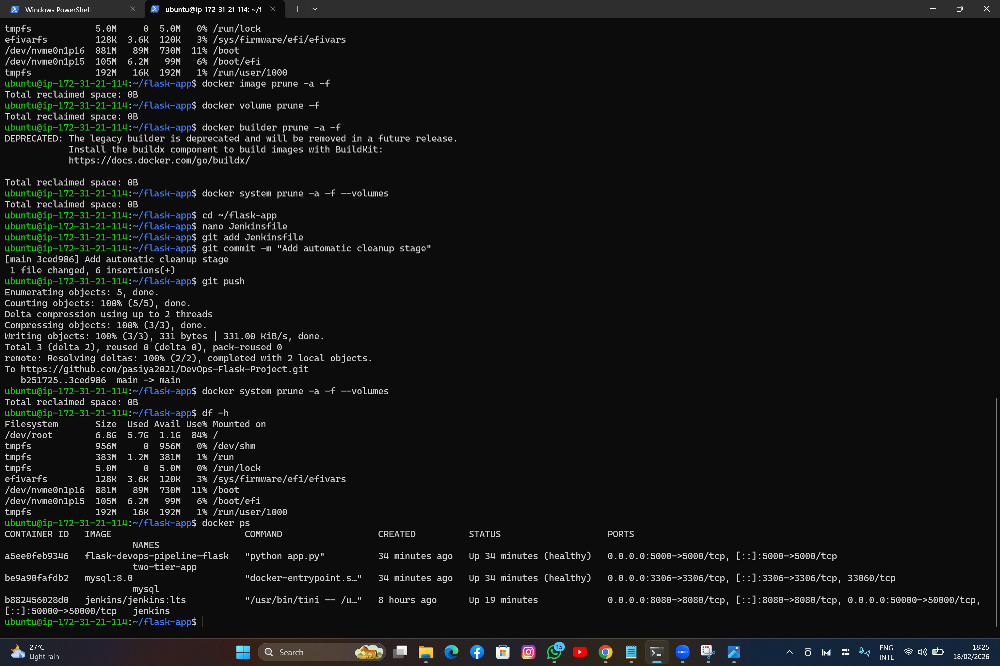

# 🚀 Two-Tier Flask Application with CI/CD Pipeline

A fully automated DevOps project demonstrating containerized deployment of a Flask + MySQL application with Jenkins CI/CD pipeline on AWS EC2.

---

## 📋 Table of Contents
- [Overview](#overview)
- [Architecture](#architecture)
- [Technologies Used](#technologies-used)
- [Features](#features)
- [Prerequisites](#prerequisites)
- [Installation & Setup](#installation--setup)
- [CI/CD Pipeline](#cicd-pipeline)
- [Screenshots](#screenshots)
- [Project Structure](#project-structure)
- [Challenges & Solutions](#challenges--solutions)
- [Future Enhancements](#future-enhancements)
- [Contributing](#contributing)
- [License](#license)

---

## 🎯 Overview

This project demonstrates a complete DevOps workflow by deploying a two-tier web application (Flask + MySQL) on AWS EC2 using Docker containers and automating the deployment process with Jenkins.

**Live Demo:** `http://43.204.92.46/:5000`

---

## 🏗️ Architecture
```
Developer → GitHub → Jenkins → Docker Build → Deploy → AWS EC2
                                                          ├── Flask Container (Port 5000)
                                                          ├── MySQL Container (Port 3306)
                                                          └── Jenkins Container (Port 8080)
```


---

## 🛠️ Technologies Used

| Category | Tools |
|----------|-------|
| **Cloud Platform** | AWS EC2 (Mumbai Region - ap-south-1) |
| **Operating System** | Ubuntu 24.04 LTS |
| **Containerization** | Docker, Docker Compose |
| **CI/CD** | Jenkins |
| **Version Control** | Git, GitHub |
| **Backend** | Python, Flask |
| **Database** | MySQL 8.0 |
| **Web Server** | Gunicorn (embedded in Flask) |

---

## ✨ Features

- ✅ **Two-Tier Architecture:** Separate Flask application and MySQL database layers
- ✅ **Containerized Deployment:** Fully dockerized application for consistency
- ✅ **Automated CI/CD:** Jenkins pipeline for automatic deployment on code push
- ✅ **Health Checks:** Container health monitoring for both Flask and MySQL
- ✅ **Persistent Storage:** Docker volumes for MySQL data persistence
- ✅ **Network Isolation:** Dedicated Docker network for inter-container communication
- ✅ **Responsive UI:** Clean, modern web interface
- ✅ **RESTful API:** Flask routes for CRUD operations

---

## 📦 Prerequisites

- AWS Account (Free Tier eligible)
- Basic understanding of:
  - Linux command line
  - Docker concepts
  - Git/GitHub
  - Python basics

---

## 🚀 Installation & Setup

### **1. AWS EC2 Setup**
```bash
# Launch EC2 Instance
- AMI: Ubuntu 24.04 LTS
- Instance Type: t3.small (2GB RAM)
- Storage: 20GB gp3
- Security Group Ports: 22, 80, 5000, 8080
```



### **2. Install Dependencies**
```bash
# Update system
sudo apt update && sudo apt upgrade -y

# Install Docker
sudo apt install docker.io docker-compose-v2 -y
sudo systemctl start docker
sudo systemctl enable docker
sudo usermod -aG docker $USER
newgrp docker

# Install Jenkins via Docker
docker run -d \
  --name jenkins \
  --restart=always \
  -p 8080:8080 \
  -p 50000:50000 \
  -v jenkins_home:/var/jenkins_home \
  -v /var/run/docker.sock:/var/run/docker.sock \
  --user root \
  jenkins/jenkins:lts

# Install Docker Compose in Jenkins
docker exec -u root jenkins curl -L \
  "https://github.com/docker/compose/releases/latest/download/docker-compose-linux-x86_64" \
  -o /usr/local/bin/docker-compose
docker exec -u root jenkins chmod +x /usr/local/bin/docker-compose
```

### **3. Clone Repository**
```bash
git clone https://github.com/pasiya2021/DevOps-Flask-Project.git
cd DevOps-Flask-Project
```

### **4. Deploy Application**
```bash
docker compose up -d --build
```

---

## 🔄 CI/CD Pipeline

### **Pipeline Stages:**

1. **Clone Code:** Pulls latest code from GitHub
2. **Stop Old Containers:** Gracefully stops running containers
3. **Start New Containers:** Deploys updated application


### **Jenkinsfile:**
```groovy
pipeline {
    agent any
    stages {
        stage('Clone Code') {
            steps {
                git branch: 'main', url: 'https://github.com/pasiya2021/DevOps-Flask-Project.git'
            }
        }
        stage('Stop Old Containers') {
            steps {
                sh 'docker-compose down || true'
            }
        }
        stage('Start New Containers') {
            steps {
                sh 'docker-compose up -d --build'
            }
        }
    }
}
```

### **Trigger Deployment:**
```bash
# Make changes to code
git add .
git commit -m "Update feature"
git push

# Jenkins automatically detects and deploys!
```

---

## 📸 Screenshots

### Application Interface


*Homepage - With Messages*

### Jenkins Dashboard


*Jenkins Pipeline Overview*


*Successful Build Stages*



### Docker Containers


*Running Containers*

---

## 📁 Project Structure
```
DevOps-Flask-Project/
├── app.py                 # Flask application
├── requirements.txt       # Python dependencies
├── Dockerfile            # Docker image definition
├── docker-compose.yml    # Multi-container orchestration
├── Jenkinsfile           # CI/CD pipeline definition
├── templates/
│   └── index.html        # Web interface
└── README.md             # Project documentation
```

---

## 🔧 Challenges & Solutions

### **Challenge 1: Disk Space Issues**
**Problem:** Jenkins builds consuming all disk space  
**Solution:** 
- Increased EBS volume from 8GB to 20GB
- Added cleanup stage in Jenkins pipeline
- Implemented `docker system prune` automation

### **Challenge 2: Container Name Conflicts**
**Problem:** Jenkins couldn't create containers due to existing names  
**Solution:** Modified Jenkinsfile to stop containers before deployment

### **Challenge 3: Memory Constraints**
**Problem:** t2.micro (1GB RAM) insufficient for all containers  
**Solution:** 
- Upgraded to t3.small (2GB RAM)
- Added 2GB swap memory
- Set memory limits per container

### **Challenge 4: Docker Compose Compatibility**
**Problem:** Jenkins had old Docker without compose plugin  
**Solution:** Manually installed docker-compose binary in Jenkins container

---

## 🚀 Future Enhancements

- [ ] Add HTTPS/SSL support with Let's Encrypt
- [ ] Implement user authentication
- [ ] Add automated testing stage in pipeline
- [ ] Set up monitoring with Prometheus + Grafana
- [ ] Implement blue-green deployment strategy
- [ ] Add database backup automation
- [ ] Create Terraform/CloudFormation templates for IaC
- [ ] Add webhook for automatic Jenkins triggers

---

## 🤝 Contributing

Contributions are welcome! Please feel free to submit a Pull Request.

1. Fork the repository
2. Create your feature branch (`git checkout -b feature/AmazingFeature`)
3. Commit your changes (`git commit -m 'Add some AmazingFeature'`)
4. Push to the branch (`git push origin feature/AmazingFeature`)
5. Open a Pull Request

---

## 📝 License

This project is licensed under the MIT License - see the LICENSE file for details.

---

## 👤 Author

**Pasindu Bandara**

- GitHub: [@pasiya2021](https://github.com/pasiya2021)
- Project Link: [https://github.com/pasiya2021/DevOps-Flask-Project](https://github.com/pasiya2021/DevOps-Flask-Project)

---

## 🙏 Acknowledgments

- Inspired by real-world DevOps practices
- Built as a learning project to demonstrate CI/CD concepts
- Thanks to the open-source community for excellent documentation

---

## 📊 Project Stats


---

**⭐ If you found this project helpful, please give it a star!**
